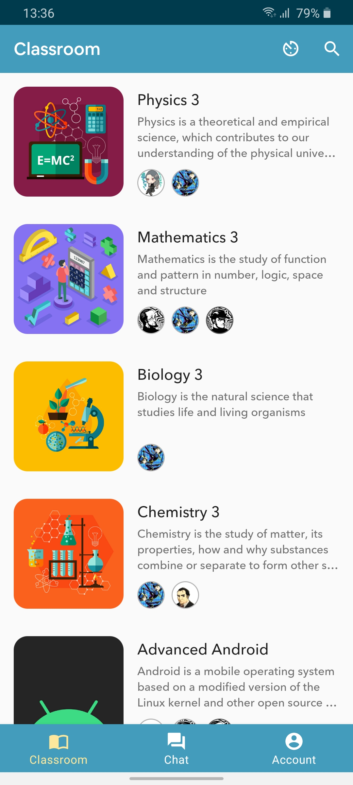
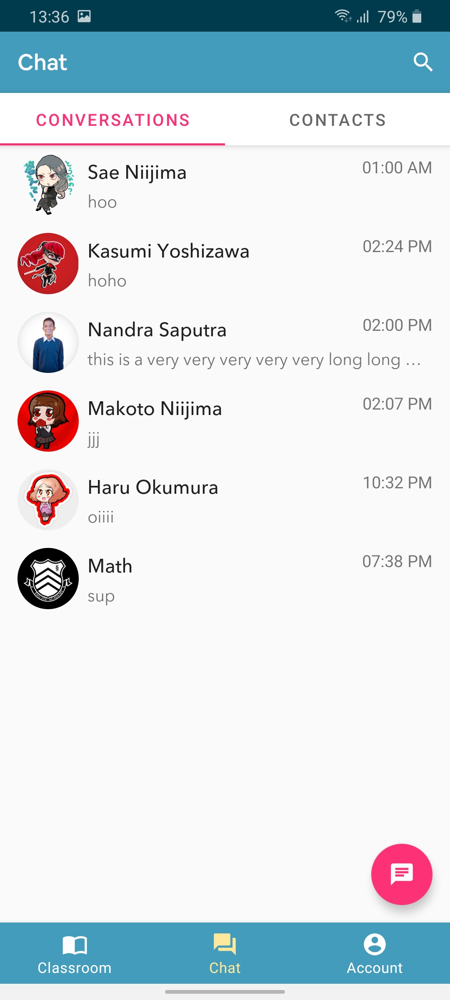

# MySchool
MySchool is an educational app for Android that has chatting, Material Sharing, Attendance and News Feed as the main feature. MySchool is written in Kotlin and built using Android <a href='https://developer.android.com/jetpack'>Jetpack</a>
Library and Kotlin <a href='https://github.com/Kotlin/kotlinx.coroutines'>Coroutine</a> to perform asynchronous operation. This app is developed to participate in <a href='https://www.dicoding.com/challenges/554'>Alcatel-Lucent Enterprise (ALE) Geek Battle Mobile Developer</a>, a <a href='https://www.dicoding.com/'>Dicoding</a> challanges.

## Preview

  
  
  

## How To Use
Login with one of these public user account (for demo purposes)

Email  | Password  |  Role
------------- | ------------- | -------------
sae.niijima@shujin.academy.jp  | Niijima123!  | Teacher
ren.amamiya@shujin.academy.jp  | Amamiya123!  | Student

WARNING: Because this is a public account, you may find inappropriate content inside, posted by other people that using this account. I will remove such thing if i find it or you could help me by contacting me if you find something inappropriate.

## Built With

<pre>
<a href='https://developer.android.com/jetpack'>Android Jetpack</a> - ViewModel, Navigation, LiveData etc.
<a href='https://firebase.google.com/'>Firebase</a> - Firebase Database, Firebase Storage and Firebase Authentication.
<a href='https://hub.openrainbow.com/#/'>RainbowAPI</a> - For News Feed and Chatting Feature.
<a href='https://github.com/hdodenhof/CircleImageView'>CircularImageView</a> - A fast circular ImageView perfect for profile images.
<a href='https://github.com/bumptech/glide'>Glide</a> - An image loading and caching library for Android focused on smooth scrolling.
<a href='https://github.com/vinc3m1/RoundedImageView'>RoundedImageView</a> - A fast ImageView that supports rounded corners, ovals, and circles.
<a href='https://github.com/facebook/shimmer-android'>Facebook Shimmer</a> - An easy, flexible way to add a shimmering effect to any view in an Android app.
</pre>

## Author

Nandra Saputra
* <a href='https://www.instagram.com/nandrasptr/'>@nandrasptr</a> on Instagram
* <a href='https://www.linkedin.com/in/nandra-saputra-b90b78157/'>LinkedIn</a> Account

##  Download Application - APK File
This app require Android 5.0 - Lolipop or higher to run, <a href='http://www.bit.ly/MySchoolDownload'>Download Link</a>

## License

Apache 2.0. See the <a href='https://github.com/nandrasaputra/MySchool/blob/master/LICENSE'>LICENSE</a> file for details.
